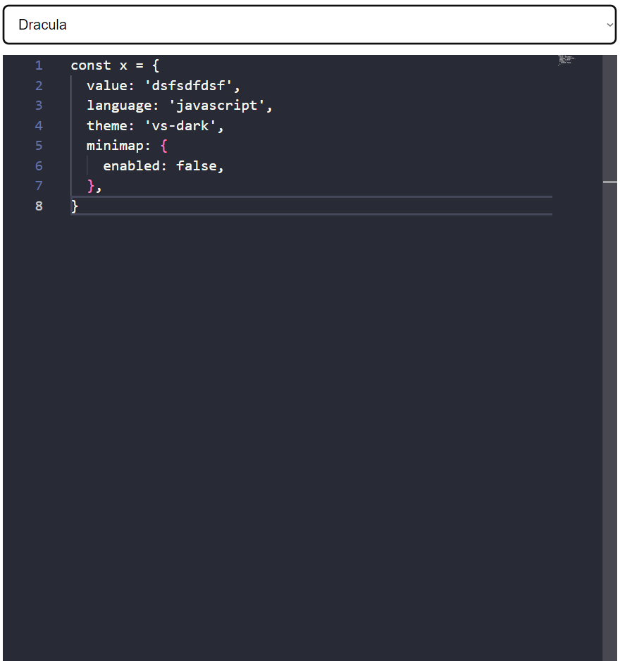

# angular monaco tm grammar and theme loading example

## [⚡️ Play on Stackblitz](https://stackblitz.com/~/github.com/relliv/angular-monaco-tm-grammar-and-theme-loading-example)

## 🌟 Preview

## ⚠️ Known Issues

- [Command palette is not working with zonejs and Angular](https://github.com/microsoft/monaco-editor/issues/4372)